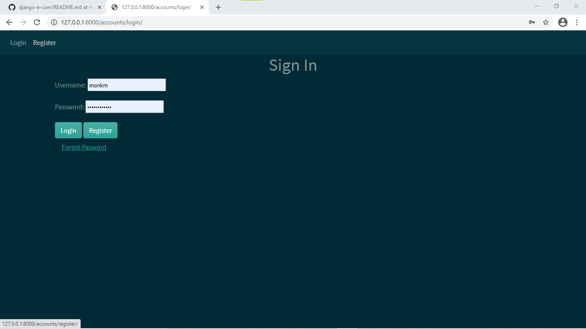
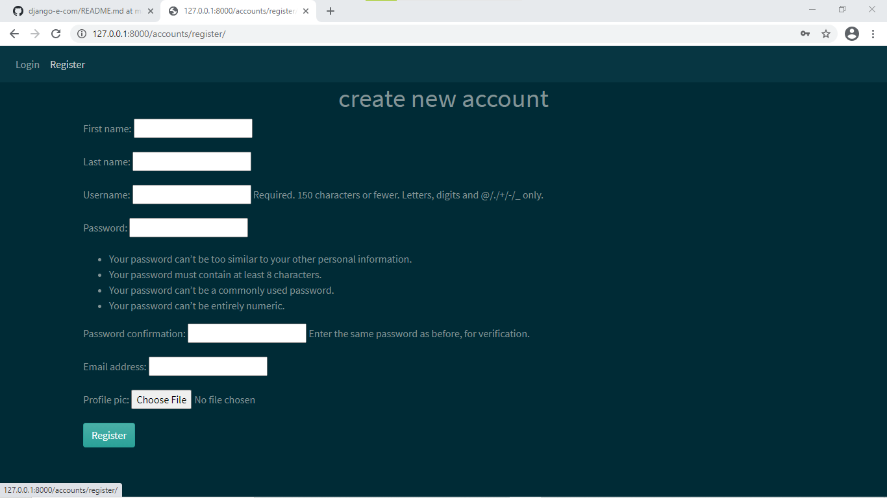
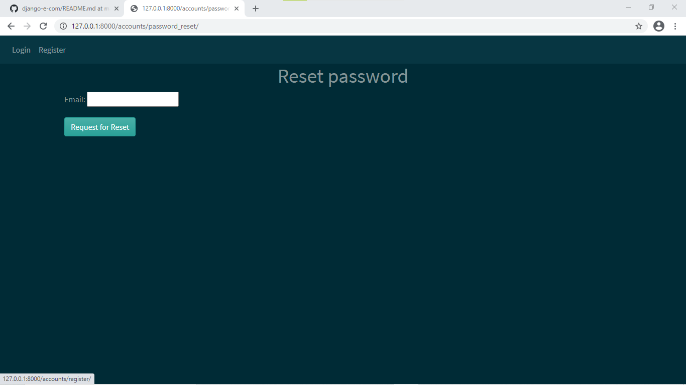
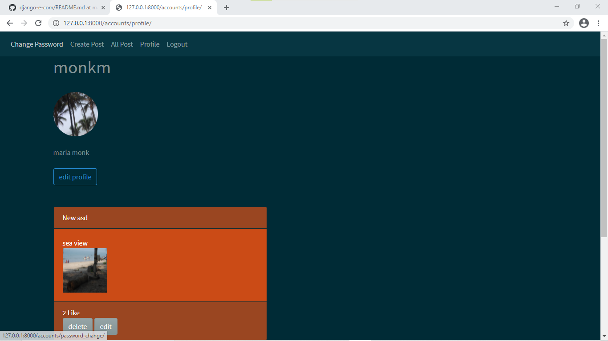
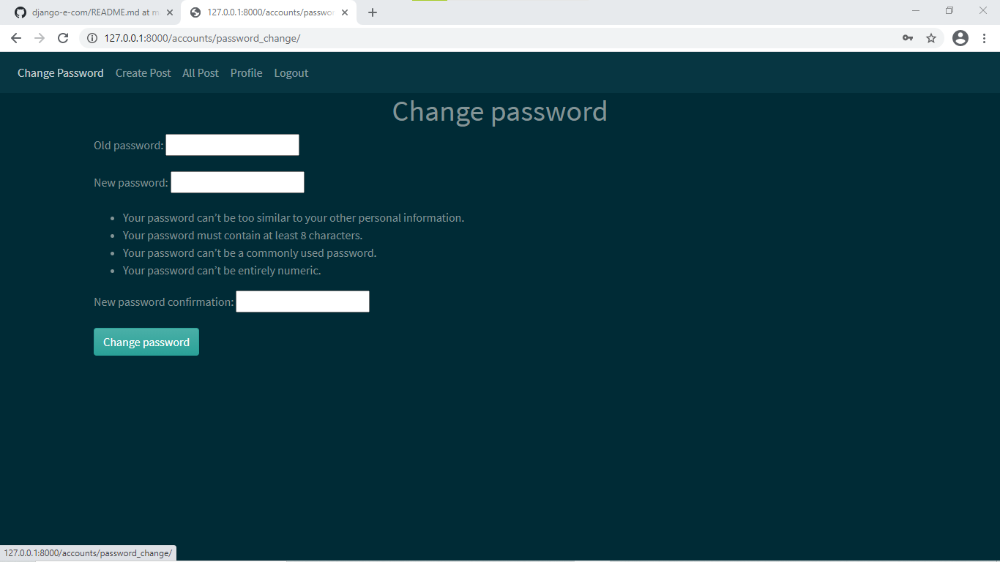
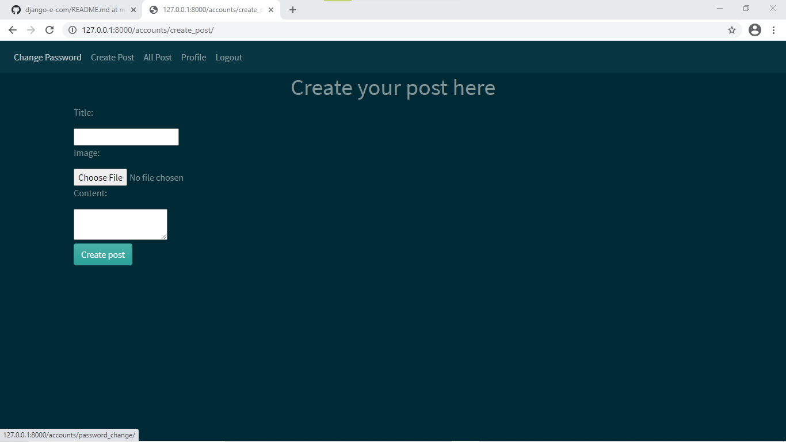

## Blog Website
This project is a simple user blog. User can add multiple post with
image, edit post, update post, like post, unlike post, delete post.

## Table of Contents

* [Instructions](#instructions)
* [Creator](#creators)

## Instructions

* ### Set-up Instructions
 1. Fork Repository.
 2. Install required packages for project.
 ```bash
 pip install -r requirements.txt
 ```
 3. Setup and activate environment.
 4. Run project
 ```bash
 python manage.py migrate
 python manage.py runserver
 ```

## Screen Shots.

 1. There is user login form.



2. Registration form for new user.



3. If user forgot the password then reset the password.



4. Here is user profile page.



5. Change password form 



6.Create post 



7. All User's post for like, dislike


## creators

* Aishwarya Lingayat
    - [GitHub](https://github.com/Aishwaryalingayat)
